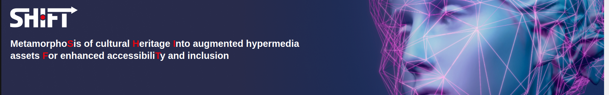

[](https://shift-europe.eu/)

[AFFECTIVE TTS](https://shift-europe.eu/) using [this phenomenon](https://huggingface.co/dkounadis/artificial-styletts2/discussions/2). Synthesize speech from `.txt` or `.srt` and overlay it to videos / picture.
  - Has [134 affective voices](https://audeering.github.io/shift/) for English tuned for [StyleTTS2](https://github.com/yl4579/StyleTTS2). Supports [single-voice foreign languages](https://github.com/audeering/shift/blob/main/Utils/all_langs.csv) TTS via [MMS](https://huggingface.co/spaces/mms-meta/MMS).
  - A Beta Version of this tool for TTS & audio soundscape is [build here](https://huggingface.co/dkounadis/artificial-styletts2)

### Available Voices

<a href="https://audeering.github.io/shift/">Listen to available voices!</a>

## Install

```
virtualenv --python=python3 ~/.envs/.my_env
source ~/.envs/.my_env/bin/activate
cd shift/
pip install -r requirements.txt
```

Demo. Result saved as `demo_affect.wav`

```
CUDA_DEVICE_ORDER=PCI_BUS_ID HF_HOME=./hf_home CUDA_VISIBLE_DEVICES=0 python demo.py
```

## API

Start Flask `api.py` on a `tmux-session`

```
CUDA_DEVICE_ORDER=PCI_BUS_ID HF_HOME=./hf_home CUDA_VISIBLE_DEVICES=0 python api.py
```

## Inference

If `api.py` runs on a different machine, copy [here](https://github.com/audeering/shift/blob/main/tts.py#L85) the IP shown in the terminal of `api.py`.


**Text To Speech**


```python
# Basic TTS - See Available Voices
python tts.py --text assets/LLM_description.txt --voice "en_US/m-ailabs_low#mary_ann"

# voice cloning
python tts.py --text assets/LLM_description.txt --native assets/native_voice.wav
```

[Listen to Various Generations](https://huggingface.co/dkounadis/artificial-styletts2/discussions/4)

**Native Voice to English (Affective) TTS**

```python
python tts.py --voice "en_US/m-ailabs_low#mary_ann"  --video assets/anbpr.webm --text assets/anbpr.en.srt
```

[](https://youtu.be/9tecQ6amHaY)

**Native voice To Romanian TTS**

```python
python tts.py --voice romanian --video assets/anbpr.webm --text assets/anbpr.ro.srt
```

[](https://youtu.be/6bYcD2IZvoU)


**Native Voice To English (Affective) TTS**

```python
python tts.py --voice "en_US/vctk_low#p306" --text assets/head_of_fortuna_en.srt --video assets/head_of_fortuna.mp4
```

[](https://www.youtube.com/watch?v=bpt7rOBENcQ)

**Img To Speech**

```python
# Video narrating an image
python tts.py --text assets/LLM_description.txt --image assets/image_from_T31.jpg --voice "en_US/cmu-arctic_low#jmk"
```

[](https://youtu.be/EjZpa8NI_gA)


