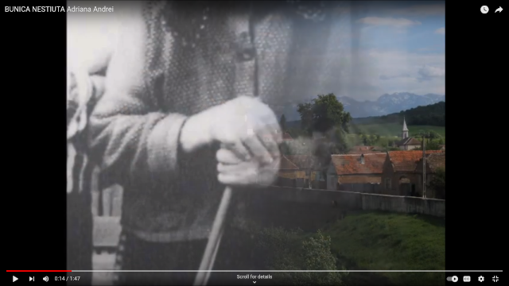
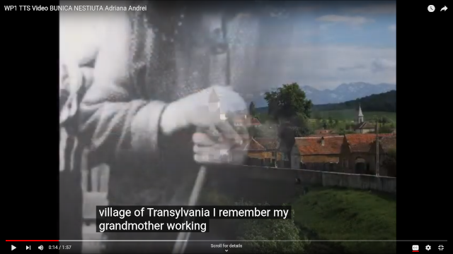
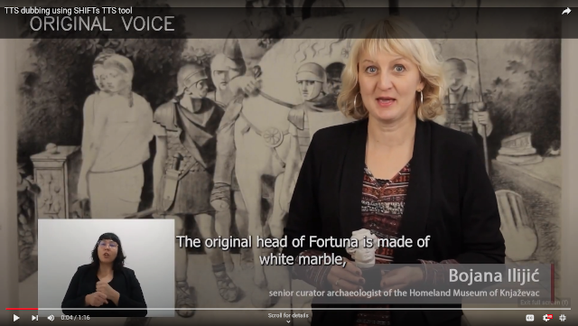
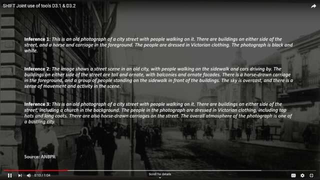

# SHIFT TTS System

Affective TTS tool for [SHIFT Horizon](https://shift-europe.eu/). Synthesizes affective speech from text or subtitles `.srt` & overlays it to videos/image.
  - Has [134 build-in voices](https://audeering.github.io/shift/) tuned for [StyleTTS2](https://github.com/yl4579/StyleTTS2) for English. Optional support for [other langauges](https://github.com/MycroftAI/mimic3-voices) via [mimic3](https://pypi.org/project/mycroft-mimic3-tts/) by downloading the foreign languages - [#HuggingFace](https://huggingface.co/mukowaty/mimic3-voices/tree/main/voices).
  - A Beta version of this tool for synthesis of speech & Audio background sound is [build here](https://huggingface.co/dkounadis/artificial-styletts2)

### Available Voices

<a href="https://audeering.github.io/shift/">Listen to available voices!</a>

## Install

```
virtualenv --python=python3 ~/.envs/.my_env
source ~/.envs/.my_env/bin/activate
cd shift/
pip install -r requirements.txt
```

Demo. TTS output saved as `out.wav`

```
CUDA_DEVICE_ORDER=PCI_BUS_ID HF_HOME=./hf_home CUDA_VISIBLE_DEVICES=0 python demo.py
```

## API

Start Flask server.

```
CUDA_DEVICE_ORDER=PCI_BUS_ID HF_HOME=./hf_home CUDA_VISIBLE_DEVICES=0 python api.py
```

## Inference

The following needs `api.py` to be already running `e.g. on tmux session`

**Text 2 Speech**

```python
# Basic TTS - See Available Voices
python tts.py --text sample.txt --voice "en_US/m-ailabs_low#mary_ann" --affective

# voice cloning
python tts.py --text sample.txt --native assets/native_voice.wav
```

**Image 2 Video**

```python
# Make video narrating an image - All above TTS args apply also here!
python tts.py --text sample.txt --image assets/image_from_T31.jpg
```

**Video 2 Video**

```python
# Video Dubbing - from time-stamped subtitles (.srt)
python tts.py --text assets/head_of_fortuna_en.srt --video assets/head_of_fortuna.mp4

# Video narration - from text description (.txt)
python tts.py --text assets/head_of_fortuna_GPT.txt --video assets/head_of_fortuna.mp4
```

## Examples

Native voice video

[](https://www.youtube.com/watch?v=tmo2UbKYAqc)

##

Same video where Native voice is replaced with English TTS voice with similar emotion


[](https://www.youtube.com/watch?v=geI1Vqn4QpY)


## Video Dubbing

[](https://www.youtube.com/watch?v=bpt7rOBENcQ)

Generate dubbed video:


```python
python tts.py --text assets/head_of_fortuna_en.srt --video assets/head_of_fortuna.mp4

```


## Joint Application of D3.1 & D3.2

[](https://youtu.be/wWC8DpOKVvQ)

From an image with caption(s) create a video:

```python

python tts.py --text sample.txt --image assets/image_from_T31.jpg
```
